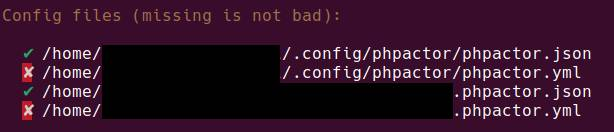

# dotfiles

This repo contains softwares configuration that I can't afford to lose:
- i3wm
- nvim
- polybar

## i3 configuration

[i3 window manager](https://i3wm.org/) configuration should go to `$XDG_CONFIG_HOME/i3`.

There is not much custom configuration:
- keyboard layout
- rofi and clipboard screen capture 
- logout/reboot/power off mode
- polybar

### Prerequisites
- rofi: dmenu replacement, with clipboard integration
- maim: screenshot utility
- feh: background utility

## neovim configuration

This configuration is optimized for a PHP environment.  
Javascript, Yaml, Twig, Json, Behat, CSS are also needed.

### Prerequisites
- [ripgrep](https://github.com/BurntSushi/ripgrep): for telescope search
- [nerdfonts](https://www.nerdfonts.com/): specificaly Hack Nerd Font
- Node (with NPM) for tsserver and others LSP
- PHP and Composer for phpactor
- [phpactor](https://github.com/phpactor/phpactor) for the nvim plugin
- python3.10-venv for Nginx LSP

### Installation
Symlink `nvim` directory to `$XDG_CONFIG_HOME/nvim` and `.vimrc` to home directory.  
Then simply run `:PlugInstall`.

### Installed plugins
- [argwrap](https://git.foosoft.net/alex/vim-argwrap.git): wrap/unwrap arguments
- [barbar](https://github.com/romgrk/barbar.nvim): buffer as tabs
- [dressing](https://github.com/stevearc/dressing.nvim): vim.ui interface
- [easy-motion](https://github.com/easymotion/vim-easymotion): move rapidly into current buffer
- [edge](https://github.com/sainnhe/edge): color theme
- [gitsigns](https://github.com/lewis6991/gitsigns.nvim): simple git integration
- [indent-blankline](https://github.com/lukas-reineke/indent-blankline.nvim): shows indentation guides
- [lspconfig](https://github.com/neovim/nvim-lspconfig): multi LSP preconfigurations
- [mardown-preview](https://github.com/iamcco/markdown-preview.nvim): markdown live preview in the browser
- [mason](https://github.com/williamboman/mason.nvim): easy LSP integration with lspconfig (with mason-lspconfig)
- [nvim-autopairs](https://github.com/windwp/nvim-autopairs)
- [nvim-cmp](https://github.com/hrsh7th/nvim-cmp): entire autocomplete feature
- [nvim-lualine](https://github.com/nvim-lualine/lualine.nvim): status line
- [quickfix-reflector](https://github.com/stefandtw/quickfix-reflector.vim): edit quickfix list
- [telescope](https://github.com/nvim-telescope/telescope.nvim)
  - [telescope-fzf-native](https://github.com/nvim-telescope/telescope-fzf-native.nvim): better file search
  - [telescope-live-grep-args](https://github.com/nvim-telescope/telescope-live-grep-args.nvim): usage of rg args
- [toggleterm](https://github.com/akinsho/toggleterm.nvim): terminal
- [tree](https://github.com/nvim-tree/nvim-tree.lua): with [web-devicons](https://github.com/nvim-tree/nvim-web-devicons)
- [tree-sitter](https://github.com/nvim-treesitter/nvim-treesitter): with text objects plugin
- [ulti-snips](https://github.com/SirVer/ultisnips/): snippets integration
- [vim-abolish](https://github.com/tpope/vim-abolish): better substitution and coercion
- [vim-fugitive](https://github.com/tpope/vim-fugitive): mostly for git blame
- [vim-illuminate](https://github.com/RRethy/vim-illuminate): match words under cursor
- [vim-plug](https://github.com/junegunn/vim-plug)
- [vim-polyglot](https://github.com/sheerun/vim-polyglot): language pack plugin
- [which-key](https://github.com/folke/which-key.nvim)
- [yaml](https://github.com/cuducos/yaml.nvim): yaml integration (yank key/value, find with Telescope)

### Installing a new plugin
1. Add the new plugin (with Plug) in the `.vimrc` inside the `plug` block.
2. Run `:PlugInstall`
3. If configuration is necessary, create a lua file in `lua/config`
4. Require it in `lua/config/init.lua`

### Installed tree-sitter parsers
- html
- javascript
- make
- php
- twig
- yaml

Install parsers with this command:
```vim
:TSInstall javascript
:TSInstall make
```

### LSP
Installing a LSP is made easy with mason-lspconfig, just run the following command to install a LSP:  
```vim
:MasonInstall dockerfile-language-server
:MasonInstall docker-compose-language-service
:MasonInstall emmet-language-server
:MasonInstall lua-language-server
:MasonInstall nginx-language-server
:MasonInstall phpactor
:MasonInstall tsserver
```

The corresponding LSP are attached in `lua/config/nvim-cmp.lua`.

### PHPActor configuration
Symlink `phpactor.json` to `$XDG_CONFIG_HOME/phpactor`, and make sure the config file is loaded:
```bash
phpactor status
```



### Troubleshooting

#### LSP
`:LspInfo` gives great infos about errors of LSP not correctly setup

#### Telescope FZF
If fzf fails to install, go to the plugin dir `$XDG_CONFIG_HOME/nvim/plugged/telescope-fzf-native.nvim` and run make: 
```bash
make
```

## polybar configuration

[polybar](https://github.com/polybar/polybar) configuration should go to `$XDG_CONFIG_HOME/polybar`.  
This configuration is required by i3.

There is a `launch.sh` script that starts the bar on each monitor.

### Prerequisites
- playerctl
